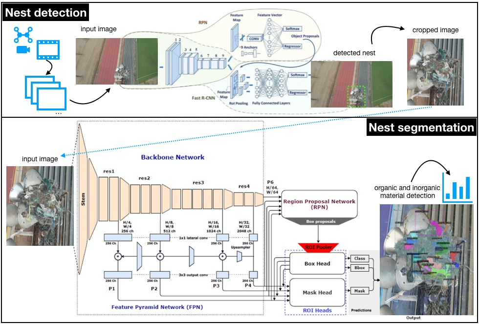

# BajaNestVision 🦅
**Deep Learning Framework for Environmental Contamination Assessment**

> Harnessing cutting-edge computer vision to protect wildlife and ecosystems in Ensenada, Baja California, Mexico through automated nest analysis and contamination detection.

[](https://huggingface.co/spaces/danie94-lml/1Baja-Nest-segmentation)
[-green)](#research-paper)
[](https://drive.google.com/drive/folders/13yB_yGzkVW4SAkHpl1FzF4PFEhD2oozN?usp=sharing)
[](https://drive.google.com/drive/folders/1mnIgWW30q5RKlCWSrbnfEJ1MClRLKV4a?usp=sharing)

## 🎯 Live Demo


**Try it yourself:** [Interactive Hugging Face Demo](https://huggingface.co/spaces/danie94-lml/1Baja-Nest-segmentation)
- Upload osprey nest images for real-time analysis
- Get instant contamination percentage assessments
- View detailed segmentation overlays
- Download comprehensive analysis reports

---

## 💼 Applications in Conservation

### Environmental Monitoring
Our methodology provides a 

non-invasive, fast, and low-cost way to monitor wildlife habitats. This approach allows for the rapid assessment of debris in nests, helping conservationists prioritize cleanup efforts.

### Industry Applications
| **Sector** | **Use Case** | **Impact** |
|------------|--------------|------------|
| **Environmental Agencies** | Habitat quality monitoring| Standardized, data-driven reporting on contaminants. |
| **Conservation Organizations** | Wildlife impact assessment | Targeted conservation strategies for at-risk nests. |
| **Research Institutions** | Large-scale ecological studies | Efficiently analyze hundreds of nests to study pollution trends. |
| **Consulting Firms** | Environmental impact surveys | Automated data collection for development projects. |

---

## 🛠 Technical Architecture

### Core Technologies
- **🤖 Deep Learning Framework**: Detectron2 for instance segmentation.
- **🧠 Model Architecture**: A **ResNet + FPN backbone** for feature extraction, enhanced with **PointRend** for high-quality segmentation boundaries. A **Faster R-CNN** model is used for initial nest detection and cropping.
- **🌐 Deployment**: Streamlit, Google Colab, Hugging Face Spaces
- **⚡ Framework**: PyTorch.

### Model Performance Metrics
| **Metric** | **Value** | **Description** |
|------------|-----------|-------------------------|
| Overall mAP | **45.92%** | Average precision across all categories and IoU thresholds. |
| AP₅₀| **75.17%** | Performance at a 50% Intersection over Union (IoU) threshold. |
| AP₇₅ | **51.26%** | Performance at a stricter 75% IoU threshold. |

### Architecture Overview


The system uses a two-stage process. First, a detection model identifies and crops the nest from a larger image. Second, a segmentation model analyzes the cropped image to identify and quantify organic and inorganic materials like plastic, ropes, and fishing nets.

---

## 📄 Research Paper

**"Fast assessment of debris in osprey Pandion haliaetus nests using deep learning
based image segmentation"**  
Status: Submitted to Multimedia Tools and Applications Journal.

### Key Research Contributions
- **🏆  A Novel Methodology**: An automated, technology-assisted workflow for examining osprey nests to quantify debris.
- **💾 The ENSOS Dataset**: Introduction of the Ensenada Osprey (ENSOS) dataset, a novel collection of images for training and validating environmental monitoring models.
- **🔬 Effective Data Augmentation**: Used a robust set of data augmentation techniques, including MixUp and Mosaic, to improve model performance and generalization from a limited dataset.
- **Efficient Training**: The model was trained in just 1 hour and 25 minutes on a single GPU, demonstrating the efficiency of the approach.

---

## 📊 Dataset & Model Resources

### 🗃 The ENSOS Dataset
**[ENSOS (Ensenada Osprey) Dataset](https://drive.google.com/drive/folders/13yB_yGzkVW4SAkHpl1FzF4PFEhD2oozN?usp=sharing)**
- **160 high-resolution** (3840×2160) images of osprey nests, manually curated from drone footage.
- **Expert annotations** for four categories: nest, plastic, rope/cloth, and fishing_net.
- **Diverse conditions**: Images captured at different heights (3m and 5m) above the nests.
- **Temporal coverage**: Drone footage was acquired between August 2023 and January 2024

### ⚡ Pre-trained Models
**[Model Weights & Checkpoints](https://drive.google.com/drive/folders/1mnIgWW30q5RKlCWSrbnfEJ1MClRLKV4a?usp=sharing)**
- **Production Model**: Final Detectron2 model weights optimized for accuracy.
- **Research Checkpoints**: Intermediate weights for reproducibility.

---

## 🌟 Environmental Impact

### Conservation Outcomes
- **🌍 Ecosystem Protection**: Enables targeted conservation efforts by identifying the nests most contaminated with dangerous materials like fishing nets and plastics.
- **📊 Data-Driven Policy**: Provides quantitative evidence that can inform local environmental regulations and cleanup campaigns.  
- **🔄 Scalable Monitoring**: The methodology can be replicated to monitor other bird species or different geographical areas

### Research Collaboration
**Active Partnerships:**
- **Universidad Autónoma de Baja California (UABC)** - Primary research institution
- **Environmental Biology Department** - Domain expertise and validation

---

## 🤝 Contributing

We welcome contributions from the global research and development community! 

### Areas for Contribution
- **🔧 Model Optimization**: Improving accuracy and efficiency
- **📊 Data Annotation**: Expanding the training dataset
- **🌐 Geographic Expansion**: Adapting to other regions and species
- **💻 Feature Development**: Adding new analysis capabilities
- **📝 Documentation**: Improving guides and tutorials

---

## 📞 Contact & Collaboration

**Primary Researcher:** Roberto Daniel Verdugo Siqueiros  
**Institution:** Universidad Autónoma de Baja California (UABC)  
**Email:** [verdugo.rds@gmail.com](mailto:verdugo.rds@gmail.com)

### Professional Opportunities
🔍 **Currently seeking opportunities** to apply this research expertise in:
- Computer Vision Engineering roles
- Environmental AI product development  
- Research Scientist positions
- Conservation technology initiatives

**Let's connect if you're building transformative environmental AI solutions!**

---

## 📜 License & Citation

### License
This project is licensed under the MIT License - see the [LICENSE](LICENSE) file for details.

### Citation
If you use BajaNestVision in your research, please cite our work:

```bibtex
@article{verdugo2024bajanest,
  title={BajaNestVision: Multi-Modal Foundation Model Integration for Environmental Contamination Assessment},
  author={Verdugo-Siqueiros, Roberto Daniel and [Co-authors]},
  journal={[Journal Name]},
  year={2024},
  note={Under Review}
}
```

---

**⭐ Star this repository if you find it useful for environmental AI research!**

*Made with ❤️ for wildlife conservation in Baja California, Mexico* 🇲🇽
